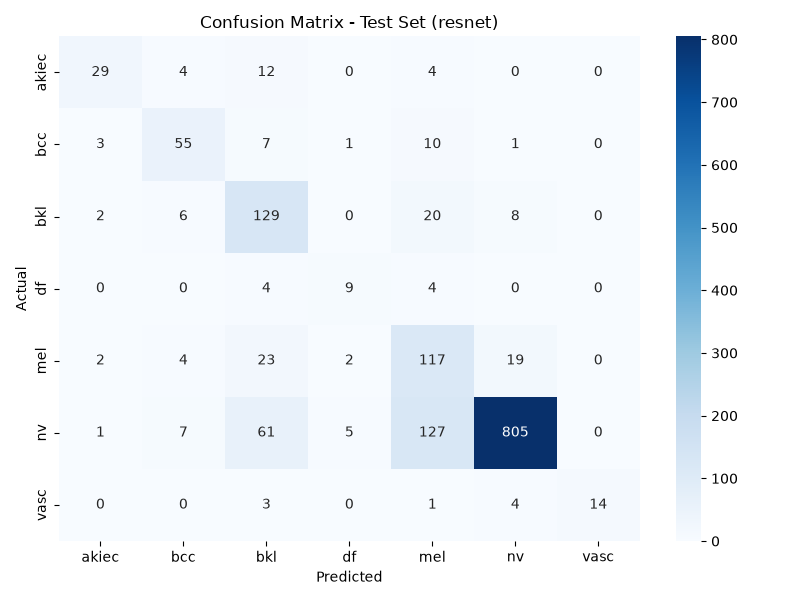
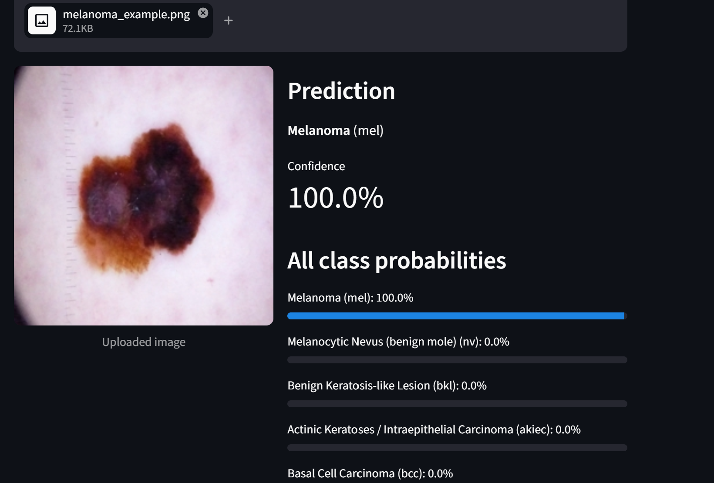

# Skin Lesion Classifier

A deep learning model that classifies dermatoscopic skin images into 7 lesion categories, including melanoma, using transfer learning. I built this end to end: data pipeline, model training with class imbalance handling, comparison across three CNN architectures, and a deployed web app.

Live demo: https://skin-lesion-classifier-tvi4fphfevpe83rvknoswq.streamlit.app/

Disclaimer: This is a personal portfolio project, not a medical diagnostic tool. It should never be used to make real health decisions. Always consult a qualified dermatologist for any skin concerns.

## Why I built this

Skin cancer is one of the most common cancers worldwide, and catching it early makes a big difference to outcomes. I wanted to see how well a CNN could classify skin lesions from dermatoscopic images into clinically meaningful categories, and specifically how well it could be trained to catch melanoma even though the available public data is heavily skewed toward benign cases.

## Dataset

I used HAM10000 (Human Against Machine with 10000 training images), available on Kaggle at kaggle.com/datasets/kmader/skin-cancer-mnist-ham10000. It contains 10,015 dermatoscopic images across 7 diagnostic categories.

| Class | Full name | Images |
|---|---|---|
| nv | Melanocytic Nevus (benign mole) | 6705 |
| mel | Melanoma | 1113 |
| bkl | Benign Keratosis like Lesion | 1099 |
| bcc | Basal Cell Carcinoma | 514 |
| akiec | Actinic Keratoses and Intraepithelial Carcinoma | 327 |
| vasc | Vascular Lesion | 142 |
| df | Dermatofibroma | 115 |

The dataset is heavily imbalanced, with about 58 times more nv images than df images. This shaped most of my approach below.

## Approach

Preprocessing

I resized all images to 224 by 224, normalized pixel values, and split the data into train, validation, and test sets (70/15/15), stratified by class.

Handling the class imbalance

I oversampled minority classes up to 1200 samples each in the training set. On top of that I applied a class weighted loss. I also augmented training images using rotation, flipping, zooming, shifting, and brightness changes, built as a tf.data pipeline and applied only to training data.

Training

I used transfer learning with ImageNet pretrained backbones rather than training a CNN from scratch. Training happened in two phases. First I trained just the classifier head with the backbone frozen. Then I unfroze the top layers and fine tuned the whole thing at a much lower learning rate. I checkpointed models based on validation macro F1 rather than accuracy, since accuracy alone is misleading on an imbalanced dataset like this. A model that just predicts benign mole every time would already score around 67 percent accuracy.

Comparing architectures

I trained and evaluated three different backbones to see which handled this problem best, rather than settling for the first one that worked.

| Backbone | Macro F1 | Accuracy | Melanoma Recall |
|---|---|---|---|
| MobileNetV2 | 0.554 | 0.692 | 0.635 |
| EfficientNetB0 | 0.621 | 0.714 | 0.575 |
| ResNet50 | 0.676 | 0.770 | 0.701 |

ResNet50 won on almost every metric, including the one I cared about most, correctly catching melanoma cases. It came at the cost of a heavier model and longer training time, which is a real tradeoff worth knowing about if this were ever going into production rather than a portfolio piece.

## Final results (ResNet50, test set)

```
              precision    recall  f1-score   support
       akiec      0.784     0.592     0.674        49
         bcc      0.724     0.714     0.719        77
         bkl      0.540     0.782     0.639       165
          df      0.529     0.529     0.529        17
         mel      0.413     0.701     0.520       167
          nv      0.962     0.800     0.874      1006
        vasc      1.000     0.636     0.778        22

    accuracy                          0.770      1503
   macro avg      0.707     0.679     0.676      1503
weighted avg      0.832     0.770     0.789      1503
```

Confusion matrix:



What the confusion matrix tells me is that the main source of error is mel and bkl getting confused with each other in both directions. This lines up with something dermatologists themselves find genuinely difficult, since melanoma and benign keratosis can look visually similar. The model also leans toward flagging things as mel or other rare classes rather than defaulting to nv, which is the direct result of the class weighting I chose. I would rather the model over flag a few benign moles as suspicious than miss real melanomas, and the numbers reflect that choice.

Known limitation: df (dermatofibroma) remains the weakest class, largely because there are only 115 training images for it in the entire dataset. Oversampling and augmentation helped, but there is a real ceiling here that more data would be needed to push past.

## App

The deployed app lets you upload a dermatoscopic image and see the predicted class along with confidence scores across all 7 categories.

Try it here: https://skin-lesion-classifier-tvi4fphfevpe83rvknoswq.streamlit.app/

Example prediction:



## Tech stack

Modeling: TensorFlow and Keras, transfer learning using MobileNetV2, EfficientNetB0, and ResNet50

Data handling: NumPy, Pandas, scikit learn, tf.data pipelines

App and deployment: Streamlit, Streamlit Community Cloud, Git LFS for the trained model file

Evaluation: classification reports, confusion matrices, macro F1 tracking

## Running it locally

```bash
git clone https://github.com/kriti3001/skin-lesion-classifier.git
cd skin-lesion-classifier
python -m venv venv
venv\Scripts\activate.bat
pip install -r requirements.txt
streamlit run app/app.py
```

You will need the trained model file, models/best_model_resnet.keras, which is tracked using Git LFS in this repo.

To retrain from scratch, you will need the HAM10000 dataset from Kaggle.

```bash
python src/preprocess.py
python src/train.py --backbone resnet
python src/evaluate.py --model models/best_model_resnet.keras --suffix resnet
```

## What I would improve next

Push df performance further, likely through a more aggressive oversampling strategy or by ensembling all three trained backbones together.

Try a Vision Transformer for comparison, though these generally need more data than this dataset provides to outperform CNNs.

Add Grad CAM visualizations so the app shows which part of the image drove the prediction, not just the class label.

## Project structure

```
skin-lesion-classifier/
    app/
        app.py
    src/
        preprocess.py
        train.py
        evaluate.py
        export_demo_images.py
        find_good_demo_examples.py
    models/
    requirements.txt
    README.md
```
